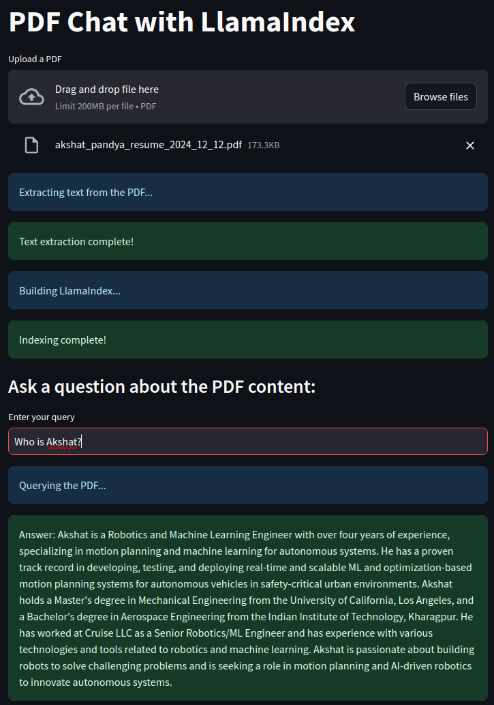

# Chat with PDF!
This is a app build on Streamlit that allow the users to upload a PDF file and ask questions about the contents. The app uses Retrieval Augmented Generation (RAG) with LlamaIndex do this semantic Q/A with PDF documents.

## Setup:
1. Clone the repository 
```
git clone https://github.com/akshatpandya/chat_with_pdf_app.git
```
2. Create a `.env` file similar to `example.env`. Update the `OPENAI_API_KEY` with your key. If you don't have an OpenAI API key, you can get one by signing up on OpenAI [website](https://openai.com/api/).
3. Install the dependencies 
```
pip install requirements.txt
```
4. Run the app 
```
streamlit run main.py
```

## Usage:
1. Upload a PDF
2. Ask questions!

